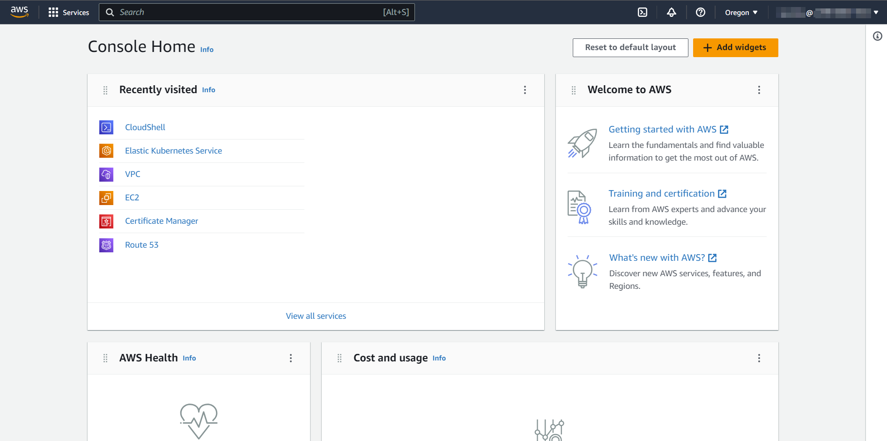

# 0. Introduction

In this tutorial, we’re going to be setting up a JupyterHub on a virtual machine hosted in the cloud. JupyterHubs are multi-user computing environments that can be accessed remotely through a web browser and offer users the opportunity to run Python code and open Linux terminals. In this case, we’re going to be running the JupyterHub server software on a *single* machine, which is relatively easy to provision and manage compared to running the server across multiple machines in a cluster.

# 1. Getting started on AWS

We’ll be doing most of our work through the AWS management console, which is a web interface through which we can provision and configure virtual hardware. This includes things like:

- Servers (virtual machines/VMs/”EC2”)
- Storage devices (virtual disks/block storage/”EBS”, object storage/”S3”)
- Networks (virtual private clouds/VPCs)

## Logging in

{}
🔗 [link expired]

{}

## Getting to know the console interface

Once you’re logged in, you’ll be greeted with the console front page:



This is a good location to bookmark in your browser, as we will be returning here often.

Here are a few elements that will be common to all console pages we visit:

- At the top left of the page is a “Services” menu and a search box, both of which can be used to navigate to control panels for the various types of virtual hardware you can provision on the cloud.
- At the very top right is our username and billing account that we are currently logged in as (username to the left of the @, account number to the right).
- Next to the username is the current region (eg, data center) we are viewing resources for. We can click this to open a menu of other data centers to switch to, allowing us to geographically distribute our virtual resources across the world.
- Finally, the icon that looks like a boxed `>_` can be clicked to open the AWS CloudShell, a Linux-style bash terminal from which we can do lightweight administration operations, run shell scripts, and use `ssh` to remote-login to virtual machines:
  
    
    
{}
⚠️ **Heads up, buddy**

Although the CloudShell is a fully featured Linux environment you have root access to, the *only directory that is persistent* is your home folder. That means if you install something with `yum` or change configuration settings, those changes will disappear once you close your browser window. In future steps that have you install CLI utilities through CloudShell, we’ll take care to instruct you how install them to your home directory where possible.

{}
    

# 2. Creating a virtual machine

We’re going to create a virtual server on the cloud, which in AWS is labelled under the brand name “EC2” (elastic compute 2).

Go to the EC2 control panel by searching “EC2” in the top bar and selecting it from the search box (circled in red):


In the center of this dashboard we’ll be able to see an overview of all the virtual machines (”instances”) created within our selected region, along with their associated auxiliary parts such as storage (”volumes”/”elastic block store”), public IP addresses (”elastic IPs”), and firewalls (”security groups”). On the left is a submenu allowing you to drill down and see more details about each of these types of resource. Generally, AWS dashboards show *all* resources owned by the current billing account, so keep in mind that some of what you see here may have been created by other users in this workshop. 


Now click the orange “Launch instance” button, and from the dropdown select the plain “Launch instance” option (rather than from a template). This will bring us to a creation wizard that lets us select the details of the machine hardware (”instance type”) and software (”image”):


Configure your new virtual machine with the following options:

- *Name:* Prefix the machine name with your username and a dash, so you can easily find it amongst the other workshop participants. Jay Doe might call their machine `jaydoe123-tljh`.
- *Application and OS Images*: Select `Ubuntu`. The version is not important for this tutorial, but note that you have the opportunity to select multiple OS versions and underlying processor architecture here. AWS also lets you use non-free, licensed operating systems like Windows Server and MacOS — by default the license for these OSes is prorated and folded into the hourly machine charge, but it’s also possible to bring your own license (”BYOL”)
  
    
    
- *Instance type:* Click the dropdown, then search for and select `t3.small`. Note how this interface shows us a summary of the hardware we will be renting, along with its price: `t3.small` machines have 2 vCPUs (representing roughly the equivalent of a 2-core processor), 2 GB of RAM, and cost $0.02 / hour.
  
    
    
    This will be sufficient for a machine to run a JupyterHub hosting one to five users at any given time, but if you want to know more about machine sizing consult the following guides:
    
    - [JupyterHub resource estimation](https://tljh.jupyter.org/en/latest/howto/admin/resource-estimation.html)
    - [AWS machine pricing table](https://aws.amazon.com/ec2/pricing/on-demand/)
- *Key pair (login):* We’ll use this box to create emergency log-in credentials we can use with an SSH client, should the web interface become broken for any reason. Expand the key pair box and click “Create new key pair”:
  
    
    
    In the box that pops up, give the keypair a name prefixed with your username (so we can identify it down the road more easily). Leave the remaining values default and click the orange “Create key pair” button. This will download a `.pem` file you can use with most ssh clients to log in to the machine as the root user, so keep the file somewhere secure:
    
    
    
- *Network Settings:* Make sure you check both “Allow HTTPS traffic from the internet” and “Allow HTTP traffic from the internet”, which are not enabled by default. This will configure the firewall to allow us to access the JupyterHub through our web browser with little fuss. 

Although the rest of the defaults here work fine for us, observe the depth of the networking options; it’s possible to isolate VMs within the same cloud account by putting them on different virtual networks.
    
    

- *Advanced Details:* If we were setting up a plain Linux machine we could leave these settings alone, but because we’re setting up a JupyterHub we’re going to make one modification here. Expand the advanced details box:
  
    
    
    Scroll down to “*User data *- optional*”*, which will be interpreted as a shell script run by the operating system when booting up for the first time. Into this box, paste the following fragment of shell code, which downloads and runs the Littlest JupyterHub installer. *Make sure to replace `<admin-user-name>` with your username.* This will be what you log in with through the web interface.
    
    ```bash
    #!/bin/bash
    curl -L https://tljh.jupyter.org/bootstrap.py \
      | sudo python3 - \
        --show-progress-page \
        --admin <admin-user-name>
    ```
    

After configuring the above settings, finally click the orange “Launch instance” button on the right side of the screen.

This will bring us to a deployment screen which should complete in under a minute. Click the instance ID (circled in red below) to go to the machine dashboard page, and then click the machine ID again (again circled in red) to go to the detail page for the machine we just created:


It takes around 5 minutes for the JupyterHub software to download and install, before which the machine may appear unresponsive through its web interface. We can monitor the progress of the installer by logging in to the machine with an SSH client.

# 3. Accessing a virtual machine through SSH

First we’ll have to upload the keypair we generated to our CloudShell environment.

Start by opening your CloudShell by clicking the `>_` button at the top of the screen (1), then selecting Actions (2) and Upload file (3):


Select and upload the `.pem` file you downloaded from the wizard while creating your virtual machine, and then confirm it’s in your home directory by running `ls` in the terminal:


Set permissions properly for the key file using the following command:

```bash
chmod 0400 <your pem filename here>
```

Now, in the machine detail screen above the terminal, copy the machine’s public IPv4 address (circled in red here). Note that it’ll be different from what is displayed in the screenshot:


Now, in the terminal, log in to the machine remotely by running the following command, replacing the `<>`-bracketed sections appropriately:

```bash
ssh -i <name of your .pem file> ubuntu@<machine's public ipv4 address>
```

Hit enter, and then say `yes` at the security prompt:


Finally, you’ll be logged in to the remote server!

Now we can view the JupyterHub installer logs, which are located in the following location on the remote machine: `/opt/tljh/installer.log`. Using the command:

```bash
sudo cat /opt/tljh/installer.log
```

We should see installer progress, hopefully ending with the message “Done!”:


# 4. Accessing the JupyterHub

If we navigate to the machine’s public IP address in a web browser, we should see the JupyterHub login page. Note that you *must manually type* in the url such that it starts with *`http://`* and not `https://`. If you don’t, your browser will default to https (which is not set up by default), and it will appear as if the server is down.

{}
⚠️ **Said it once before but it bears repeating:**

By default your browser will try very hard to prepend `https://` to your URL, which will make it appear that the server isn’t responding. You have to manually type `http://` whenever you access your VM’s web interface. We’re emphasizing this because Naomi has taught this workshop multiple times and *still* forgets, and *still* spends hours investigating why things appear broken. She’s never getting those hours of her life back. Don’t be like Naomi.

{}


From the login page, use the administrator username you chose while configuring the virtual machine’s user data. Whatever you enter upon this first login will be saved as the administrator password.

From here, you have access to a file manager through which you can open Python notebooks, bash terminals, and the user administration page.

## Opening a terminal

From the file manager, click the `New` dropdown menu in the top-right of the screen. Select `Terminal`. This presents users with a bash terminal on the remote machine without the need for end-users to install `ssh` or configure secure key pairs.


Let’s install a utility:

```bash
sudo apt install cowsay
```

And test it:

```bash
/usr/games/cowsay howdy pardner
```


## Running python code

From the file file manager, click `New` and select `Python 3 (ipykernel)`

Try running some python code by entering the following into a notebook cell and hitting Shift+Enter:

```bash
import subprocess
print(subprocess.run(
    ["/usr/games/cowsay", "python can be so MOOving"],
    stdout=subprocess.PIPE, text=True).stdout)
```


## Managing users

If you’re an administrator on the machine, you can add and remove users, as well as view who is presently logged in, by clicking the “Control panel” button in the top right of the screen, and then clicking Admin:


Although you can create and delete users, they have full control over their own passwords; it will be set on first login, as it was for your administrator account. 

To change this behavior to a more traditional “sign-up page” flow, after which you can approve attempted user registrations, follow this guide:

{}
🔗 [https://tljh.jupyter.org/en/latest/howto/auth/nativeauth.html](https://tljh.jupyter.org/en/latest/howto/auth/nativeauth.html)

{}

## Further configuration

There are *many* configuration options for Littlest JupyterHubs, including:

- the ability to integrate user management with external directory services
- secure the server’s web interface with HTTPS (something we’ll be doing later today)
- attach external disks shared among multiple VMs
- select python and OS packages that are installed by default

To delve in further, take a look at their customization guide:

{}
🔗 [https://tljh.jupyter.org/en/latest/howto/index.html](https://tljh.jupyter.org/en/latest/howto/index.html)

{}

# 5. Shutting down the machine

On the cloud, you’re billed for virtual machines that are turned on whether they’re running a workload or not. You’re also billed for stopped hard disks, though these costs are usually negligible compared to the rate for VMs sized for scientific workloads.

To shut the server down so we’re no longer being charged for it, go back to the VM detail page, select “Actions”, and then “Manage instance state”:


From this page, select “Stop” and then “Change instance state”:


Confirm that the machine turns off by hitting the refresh button on the VM list you’re brought to, until the instance state reflects “Stopped”:


We are then free to turn the instance back on whenever we like, again by selecting it and managing the instance state. 

To *completely delete* the VM and its storage disk, we would select *Terminate*, which is not an action that can be undone.

# Acknowledgements

This guide was based on the official [AWS installation guide](https://tljh.jupyter.org/en/latest/install/amazon.html) written by the Littlest JupyterHub developers.