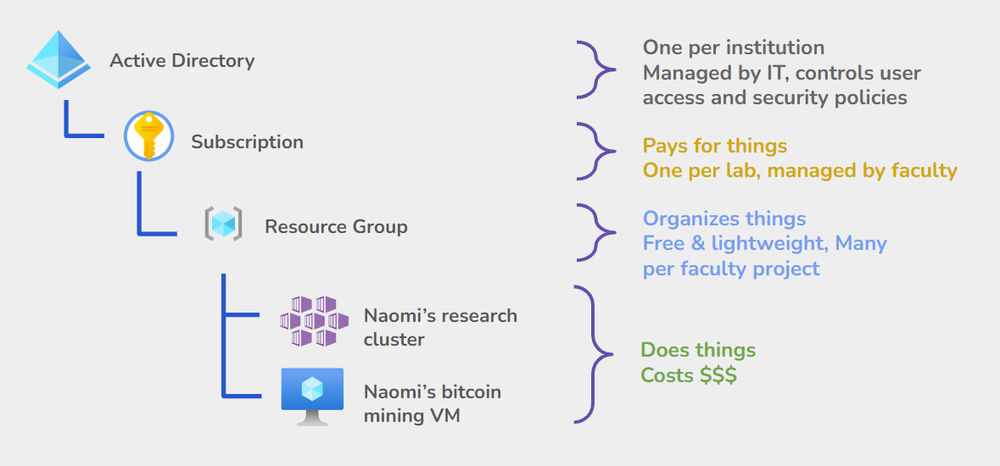

# 0. Introduction

In this tutorial, we’re going to be setting up a JupyterHub on a virtual machine hosted in the cloud. JupyterHubs are multi-user computing environments that can be accessed remotely through a web browser and offer users the opportunity to run Python code and open Linux terminals. In this case, we’re going to be running the JupyterHub server software on a **single** machine, which is relatively easy to provision and manage compared to running the server across multiple machines in a cluster.

# 1. Getting started on Azure

We’ll be doing most of our work through the Azure portal, which is a web interface through which we can provision and configure virtual hardware. This includes things like:

- Servers (virtual machines/VMs)
- Storage devices (virtual disks/block storage, object storage/”blob storage”)
- Networks (virtual networks)

## Azure administrative jargon

Azure uses several different administrative structures to keep track of the cloud resources we’ll be creating. Here’s a quick overview of the common ones we’ll be encountering:



Broadly, all virtual servers, users, billing accounts, and, well, **everything,** is housed within an **active directory (AD)**.

Within an AD, the actual billing details are linked to a **subscription**. There can be many different subscriptions, which can be funded in a number of different ways. Generally, organizational units that manage their own budgets (like research groups or sub-groups within university IT) will each have their own subscription.

Within a subscription, resources like servers and hard drives can be arbitrarily organized into **resource groups (RGs)**. Resource groups are effectively like folders to sort your virtual hardware into. RGs can have their own access control and user permissions, to control who within an organization can view or modify what’s there. RGs are free and easy to create/delete.

Finally, within an RG, we have actual **cloud resources**. These are the pieces of virtual hardware that actually do work and accrue billing.

Today, we’ll be creating resource groups and cloud resources. The subscription and AD are provided to us.

## Logging in

Navigate to the Azure portal and sign in:

{}
🔗 [https://portal.azure.com](https://portal.azure.com/)
{}

## Getting to know the portal interface

Once you’re logged in, you’ll be greeted with the portal front page:


This is a good location to bookmark in your browser, as we will be returning here often.

Here are a few elements that will be common to all console pages we visit:

- At the top left of the page is a “hamburger menu” (opened with the `☰` icon) and a search box, both of which can be used to navigate to control panels for the various types of virtual hardware you can provision on the cloud.
    
- The icon that looks like a boxed `>_` can be clicked to open the **Azure CloudShell**, a Linux-style bash terminal from which we can do lightweight administration operations, run shell scripts, and use `ssh` to remote-login to virtual machines. Click it now (1) to start the configuration process. When prompted, select Bash as your shell environment (2):
  
    
    

Next, you’ll be prompted to create a storage account to hold your shell’s user directory. Leave the defaults specified and click “Create storage”:


After a minute or two, you should be brought to a terminal emulator within which you can run commands and shell scripts:


# 2. Creating a virtual machine

Now let’s create a virtual server on the cloud. Search “virtual machine” in the top bar and select it from the search box (circled in red):


This table will show us an overview of all the virtual machines (”instances”) that we have user permissions to view Keep in mind that some of what you see here may have been created by other users in this workshop. 

Now click the “+Create” button (1), and from the dropdown select the plain “Azure virtual machine” option (2):


This will bring us to a creation wizard that lets us select the details of the machine:


### Basics

Configure your new virtual machine with the following options:

- **Resource group:** This is the equivalent of a folder to keep track of all the assorted virtual hardware we’re creating as a result of this wizard. Click `Create new`, and name it something that starts with your username. That way, it’ll be easier to find later.
- **Virtual machine name:** Prefix the machine name with your username and a dash, so you can easily find it amongst the other workshop participants. Jay Doe might call their machine `jaydoe123-tljh`.
- **Region:** This is the geographic location of the datacenter containing our machine. You can leave this as the default.
- **Image**: Leave the default selected, `Ubuntu Server`. Note that you have the opportunity to select different OS versions and underlying processor architecture here. Microsoft also lets you use non-free, licensed operating systems like Windows Server or RedHat Enterprise Linux — by default the license for these OSes is prorated and folded into the hourly machine charge, but it’s also possible to bring your own license (”BYOL”)
- **Size:** This setting selects the specs of the virtual machine we’ll be reserving. Note how this interface shows us a summary of the hardware we will be renting, along with its price: `Standard_D2s_v3` machines have 2 vCPUs (representing roughly the equivalent of a 2-core processor), 8 GB of RAM, and cost $70.78 / month (roughly $0.09 / hour). Note that VM rental prices are prorated to the hour, so we will **not** spend $70 just by nature of clicking the “create” button.
  
    These specs will be sufficient for a machine to run a JupyterHub hosting several users at any given time, but if you want to know more about machine sizing consult the following guides:
    
    - [JupyterHub resource estimation](https://tljh.jupyter.org/en/latest/howto/admin/resource-estimation.html)
    - [Azure machine pricing table](https://azure.microsoft.com/en-us/pricing/details/virtual-machines/linux/)
- **Administrator account:** These settings allow us to select the root user’s username and log-in credentials. Leave them as default — we’ll be offered the chance to download the SSH key later.
- **Inbound port rules:** These settings control the machine’s firewall. Expand the dropdown and select both HTTP and HTTPS, which are not enabled by default:
  
    
    

Once you’re done with these settings, click the “Next : Disks >” button.

### Disks

Here you have an opportunity to configure the VM’s boot disk and attach any extra block storage. Leave these settings as default and click “Next : Networking >”.

### Networking

On this page you have an opportunity to configure the network settings of the VM. Check the box to delete the IP and NIC when the VM is deleted, so that we don’t lose track of those resources and end up paying for them longer than they are actually useful:


Although we can leave the remaining Networking defaults as is, observe the depth of the options; it’s possible to isolate VMs within the same cloud account by putting them on different virtual networks.

Click “Next : Management >” to proceed.

### Management

On this page we have the opportunity to specify details about how users are managed, as well as the ability to set a timer that automatically shuts down the VM. This can be very useful if you know a VM will not be needed outside of working hours, and thus can make sure it is turned off and not billed while it’s not in use.

That said, we’ll leave these details as is and click “Next : Monitoring >”

### Monitoring

Leave these settings at their defaults, and proceed with “Next : Advanced >”

### Advanced

Here we are presented with a few remaining configuration options. If we were setting up a plain Linux machine we could leave these settings alone, but because we’re setting up a JupyterHub we’re going to make one modification here.

Scroll down to “**Custom data and cloud init**”, which will be interpreted as a shell script run by the operating system when booting up for the first time. Into this box, paste the following fragment of shell code, which downloads and runs the Littlest JupyterHub installer. **Make sure to replace `<admin-user-name>` with the root username you specified earlier in the wizard.** This will be what you log in with through the web interface.

```bash
#!/bin/bash
curl -L https://tljh.jupyter.org/bootstrap.py \
  | sudo python3 - \
    --show-progress-page \
    --admin <admin-user-name>
```

After configuring the above settings, finally click the blue “Review & Create” button on the lower left of the screen.

### Finish up

Click through to the “Review + create” tab, and click the blue “Create” button at the bottom of the page.

At this point, a dialog will pop up regarding generating a new key pair:


Click the blue “Download private key” button, which will download a `.pem` file you can use with most ssh clients to log in to the machine as the root user. Be sure to keep this file somewhere secure. We’ll use it soon to log in to the machine remotely.

After this, we’ll be brought to a deployment progress screen. After a minute or so, deployment should be complete and we’ll be presented with a blue “Go to resource” button. Click that:


This page will present us a dashboard summarizing details about the machine, including its public IP address that we can use to access it:


It takes around 5 minutes for the JupyterHub software to download and install, before which the machine may appear unresponsive through its web interface. We can monitor the progress of the installer by logging in to the machine with an SSH client.

# 3. Accessing a virtual machine through SSH

First we’ll have to upload the keypair we generated to our CloudShell environment.

Start by opening your CloudShell by clicking the `>_` button at the top of the screen (1), then the shell’s “Upload/download” button (2), and finally “Upload” (3):


Select and upload the `.pem` file you downloaded from the wizard while creating your virtual machine, and then confirm it’s in your home directory by running `ls` in the terminal:


Set permissions properly for the key file using the following command:

```bash
chmod 0400 <your pem filename here>
```

Now, in the machine detail screen above the terminal, copy the machine’s public IPv4 address (circled in red here). Note that it’ll be different from what is displayed in the screenshot:


In the terminal, log in to the machine remotely by running the following command, replacing the `<>`-bracketed sections appropriately. The root username is the name you selected during the wizard (the default is “azureuser”)

```bash
ssh -i <name of your .pem file> <root username>@<machine's public ipv4 address>
```

Hit enter, and then say `yes` at the security prompt:


Finally, you’ll be logged in to the remote server!


Now we can view the JupyterHub installer logs, which are located in the following location on the remote machine: `/opt/tljh/installer.log`. Using the command:

```bash
sudo cat /opt/tljh/installer.log
```

We should see installer progress, hopefully ending with the message “Done!”:


# 4. Accessing the JupyterHub

If we navigate to the machine’s public IP address in a web browser, we should see the JupyterHub login page. Note that you ****must manually type**** in the url such that it starts with **`http://`** and not `https://`. If you don’t, your browser will default to https (which is not set up by default), and it will appear as if the server is down.



⚠️ **Said it once before but it bears repeating:**

By default your browser will try very hard to prepend `https://` to your URL, which will make it appear that the server isn’t responding. You have to manually type `http://` whenever you access your VM’s web interface. We’re emphasizing this because Naomi has taught this workshop multiple times and **still** forgets, and **still** spends hours investigating why things appear broken. She’s never getting those hours of her life back. Don’t be like Naomi.



From the login page, use the administrator username you chose while configuring the virtual machine’s user data. Whatever you enter upon this first login will be saved as the administrator password.

From here, you have access to a file manager through which you can open Python notebooks, bash terminals, and the user administration page.

## Opening a terminal

From the file manager, click the `New` dropdown menu in the top-right of the screen. Select `Terminal`. This presents users with a bash terminal on the remote machine without the need for end-users to install `ssh` or configure secure key pairs.


Let’s install a utility:

```bash
sudo apt install cowsay
```

And test it:

```bash
/usr/games/cowsay howdy pardner
```


## Running python code

From the file file manager, click `New` and select `Python 3 (ipykernel)`

Try running some python code by entering the following into a notebook cell and hitting Shift+Enter:

```bash
import subprocess
print(subprocess.run(
    ["/usr/games/cowsay", "python can be so MOOving"],
    stdout=subprocess.PIPE, text=True).stdout)
```


## Managing users

If you’re an administrator on the machine, you can add and remove users, as well as view who is presently logged in, by clicking the “Control panel” button in the top right of the screen, and then clicking Admin:


Although you can create and delete users, they have full control over their own passwords; it will be set on first login, as it was for your administrator account. 

To change this behavior to a more traditional “sign-up page” flow, after which you can approve attempted user registrations, follow this guide:

{}
🔗 [https://tljh.jupyter.org/en/latest/howto/auth/nativeauth.html](https://tljh.jupyter.org/en/latest/howto/auth/nativeauth.html)
{}

## Further configuration

There are **many** configuration options for Littlest JupyterHubs, including:

- the ability to integrate user management with external directory services
- secure the server’s web interface with HTTPS (something we’ll be doing later today)
- attach external disks shared among multiple VMs
- select python and OS packages that are installed by default

To delve in further, take a look at their customization guide:

{}
🔗 [https://tljh.jupyter.org/en/latest/howto/index.html](https://tljh.jupyter.org/en/latest/howto/index.html)
{}

# 5. Shutting down the machine

On the cloud, you’re billed for virtual machines that are turned on whether they’re running a workload or not. You’re also billed for stopped hard disks, though these costs are usually negligible compared to the rate for VMs sized for scientific workloads.

To shut the server down so we’re no longer being charged for it, go back to the VM detail page and click the “Stop” button:


Select “yes” at the confirmation dialog, and then observe that the machine turns off after a minute or so:


We are then free to turn the instance back on whenever we like using the “Start” button.

To **completely delete** the VM and its storage disk, we would click “Delete”, which is not an action that can be undone.

# Acknowledgements

This guide was based on the official [Azure installation guide](https://tljh.jupyter.org/en/latest/install/azure.html) written by the Littlest JupyterHub developers.